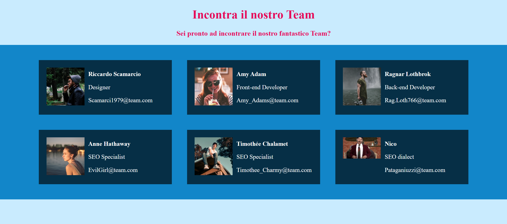

<h1 align="center">Our Team</h1>

###

  
  
  
  
  
  
  

###

Dato un array di oggetti rappresentante un team di un’azienda, creare una pagina dedicata  in cui mostrare una card per ciascun componente.  (trovate l’array del team all’interno della cartella in allegato)  Bonus  Rendere l’esercizio responsive, mandando a capo le card 🤓

###

